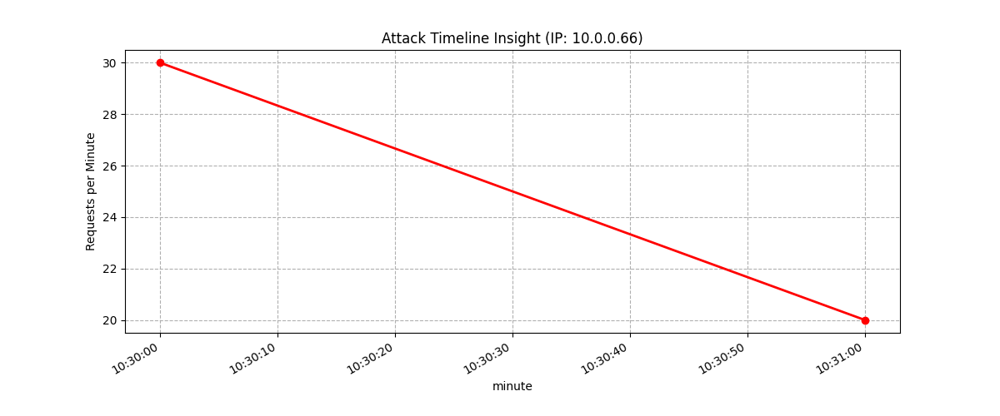
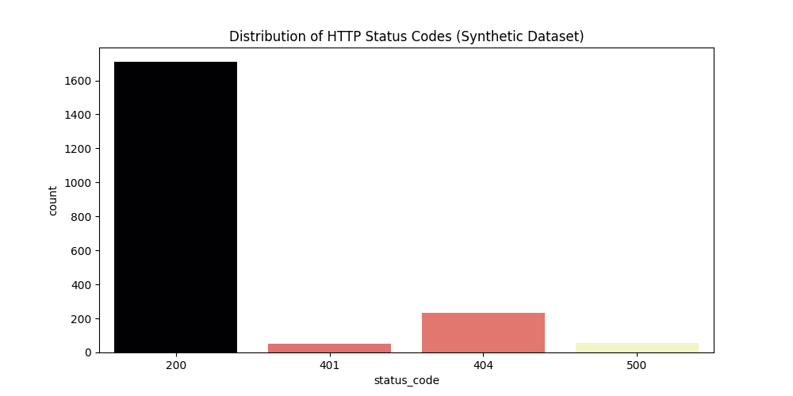

# 🛡️ Cyber-Security: Brute-Force Detection (Synthetic EDA)

### 📊 Project Overview
This module focuses on **Synthetic Data Engineering** for cyber-security monitoring. It simulates a realistic web server environment where a targeted **Brute-Force attack** is hidden among normal user traffic. 

### ⚙️ Key Technical Features
- **Anomaly Injection**: Scripted burst of `401 Unauthorized` attempts from a single external IP.
- **LLM Benchmarking**: Generation of `llm_task_definition.txt` used to test if AI models can correctly identify the attacker and the attack window.
- **Automated Reporting**: Exporting machine-readable `JSON` summaries and system logs.

### 📈 Visual Insights
Below are the results generated by the analysis engine:

#### 1. Attack Timeline
*Identifies the exact minute the Brute-Force attack occurred.*

#### 2. HTTP Status Distribution
*Shows the spike in 401 errors compared to normal 200/404 traffic.*

### 📂 File Structure
- `synthetic_security_eda.py`: The core generation & analysis engine.
- `security_summary.json`: Automated statistical report.
- `llm_task_definition.txt`: Evaluation context for AI models.
- `system_run.log`: Traceability of the script execution.
