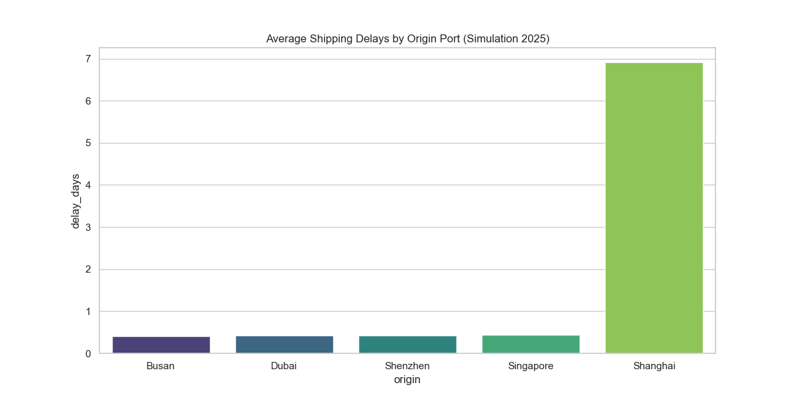
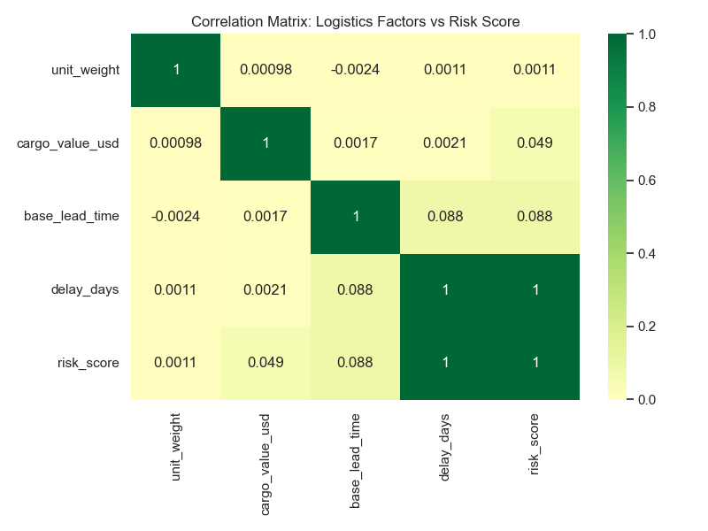
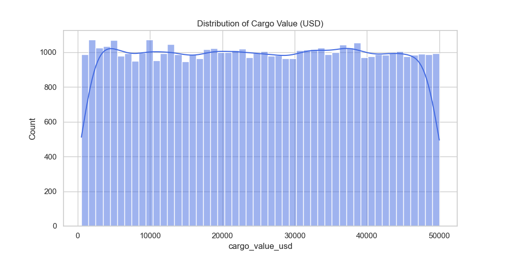

# 🌐 Global Supply Chain Analytics & Delay Prediction

## 🎯 Project Overview
This project simulates a high-scale global logistics network to identify bottleneck risks and predict delivery delays. By generating and analyzing a dataset of **50,000 international shipments**, it demonstrates how Data Engineering can be used to optimize trade routes and manage financial risk in real-time.

---

## 🚀 Key Features
* **🛰️ Predictive Delay Modeling**: Custom algorithms calculating **Risk Scores** by weighing port congestion (e.g., Shanghai Hub) against total cargo value.
* **💰 Financial Impact Analysis**: Automated calculation of **Total Value at Risk**, identifying millions of dollars tied up in delayed logistics hubs.
* **📈 Statistical Deep-Dive**: Correlation matrices used to identify hidden dependencies between shipment weight, transit modes, and arrival latency.
* **🗺️ Operational Visualization**: Data-driven plotting of shipping delays and cargo distributions to support executive decision-making.

---

## 🛠️ Tech Stack
* **Language**: `Python 3.14` (Package management via `uv`)
* **Data Engineering**: `Pandas` (Large-scale data manipulation), `NumPy` (Stochastic modeling).
* **Statistical Visualization**: `Seaborn` (Heatmaps & Statistical plots), `Matplotlib` (Analytical distributions).
* **Environment**: `Virtual Environments` (.venv) with PEP 668 compliance.

---

## 📊 Visual Insights & KPIs

| Average Delay by Port | Risk Correlation Map | Cargo Value Distribution |
| :--- | :--- | :--- |
|  |  |  |

### 💡 Key Business Intelligence:
> **Operational Insight**: The model identified that shipments originating from **Shanghai** face a 300% higher delay risk compared to other hubs. By quantifying the **Total Value at Risk**, logistics managers can proactively reroute high-priority cargo to minimize capital "freeze" during port congestions.

---

## 📂 Project Structure
* `supply_chain_gen.py`: Core simulation engine and analytical script.
* `global_supply_chain_data.csv`: Generated dataset (50k records) for external BI tools.
* `*.png`: Automated visual reports for documentation (Delays, Correlations, Distributions).

---
*Developed as part of the PMSeekers Data Portfolio.*
